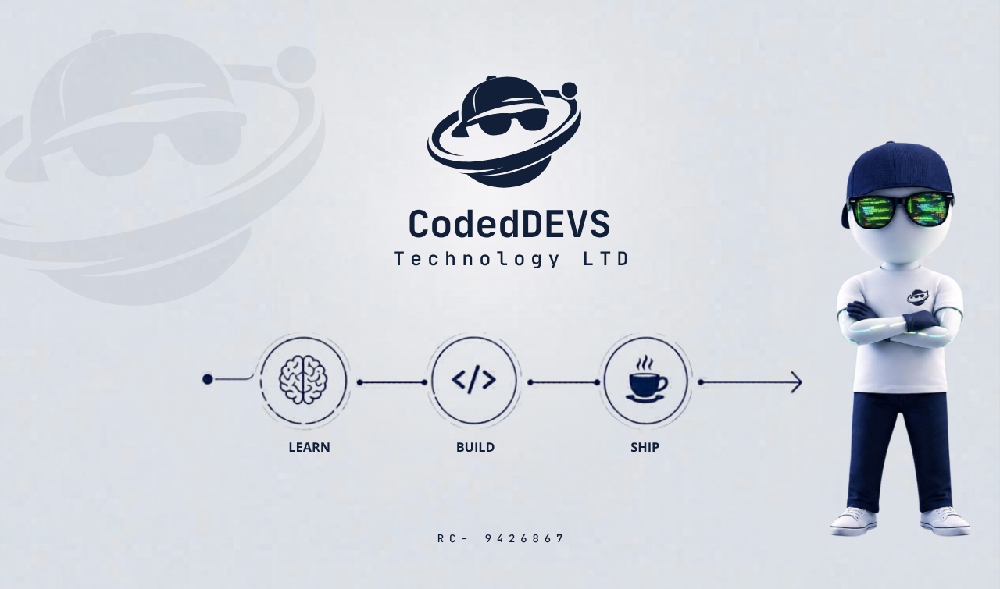

  

## About Us

- 🤖 **AI-powered tools** – Intelligent systems that solve real problems, even offline
- 🌐 **Web applications** – Full-stack platforms with premium user experiences
- 🔧 **Developer tools** – Utilities and solutions that make building easier
- 💡 **Real-world problem solving** – Software designed for African markets and beyond

---

## 🚀 Products & Services

  <table border="0">
    <tr>
      <td width="200" align="center" style="border: none;">
        
      </td>
      <td style="border: none;" align="left">
        <h3>🛍️ Twizrr</h3>
        
A social-commerce marketplace where users discover products through a scrollable feed, follow merchants, and buy with secure escrow payments, while sellers manage orders and get paid instantly.

        
      </td>
    </tr>
  </table>

---

## Hackathon Achievements
| Project                                                 | Hackathon                                                                  | Placement        |
| ------------------------------------------------------- | -------------------------------------------------------------------------- | ---------------- |
| **💬 [DialAI](https://dailai.vercel.app)**              | Build with AI Build with AT: Generative AI + APIs Across Africa (Feb 2026) | 🥇 **1st Place** |
| **🛒 [Swifta](https://www.swifta.store)**              | Africa's Talking and Google Build with AI Program Finale - Kenya, Nigeria and South Africa. | 🥇 **1st Place** |
| **🏗️ [Swiftrade](https://swift-trade-psi.vercel.app)** | Build for Hardware Lagos: Africa's Talking Innovation Hackathon (Feb 2026) | 🥉 **3rd Place** |

---

  

