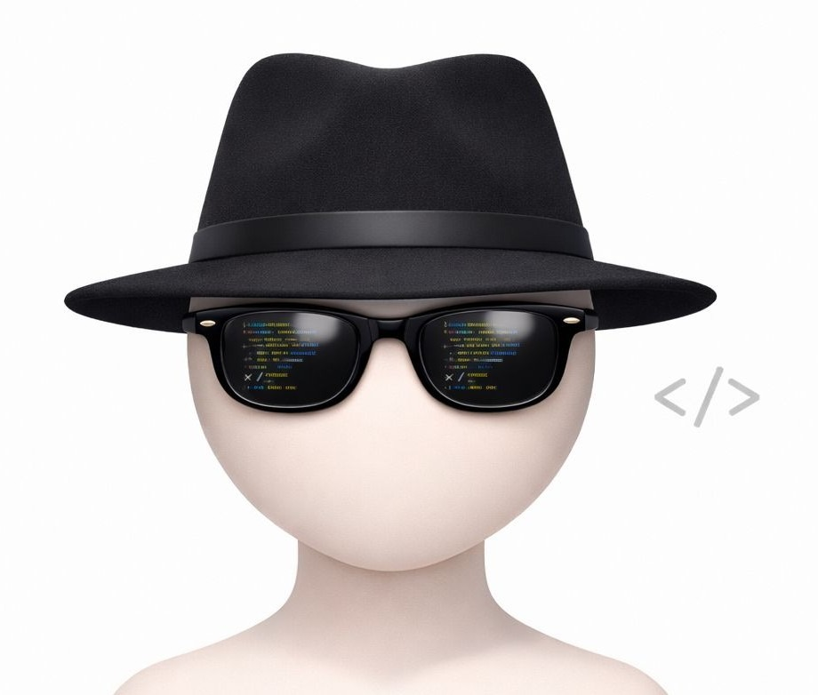

<div align="center">
  
</div>

<h1 align="center">Coded Devs </h1>
<h3 align="center">
  
</h3>

<p align="center">
  We are a small team of developers building real-world software solutions and AI-powered tools.<br />
  Our journey started through hackathons and collaborative projects — now we're focused on building scalable products.
</p>

---

## 🛠️ Tech Stack


---

## 🔥 What We Build

- 🤖 **AI-powered tools** – Intelligent systems that solve real problems, even offline
- 🌐 **Web applications** – Full-stack platforms with premium user experiences
- 🔧 **Developer tools** – Utilities and solutions that make building easier
- 💡 **Real-world problem solving** – Software designed for African markets and beyond

---

## 🚀 Current Projects

- **💬 [DialAI](https://dailai.vercel.app)** – Offline-first AI assistant accessible via phone (USSD, SMS, voice). Built for low-connectivity environments
- **🎓 [FindMyCenter](https://github.com/coded-devs/find-my-center.git)** – Location discovery platform helping Nigerian JAMB students find exam centers on slow networks
- **🎓 [Swifta](https://swifta.store)** – Buy and sell anything on WhatsApp with escrow payment protection. Discover products, follow merchants, and shop securely — all from the app you already use.

---

## 💭 Our Philosophy

```
Learning → Building → Shipping
```

We believe in building practical solutions and shipping fast. Every project starts with a real problem, gets built with modern tools, and gets shipped to real users.

---

## � Hackathon Achievements
| Project                                                 | Hackathon                                                                  | Placement        |
| ------------------------------------------------------- | -------------------------------------------------------------------------- | ---------------- |
| **💬 [DialAI](https://dailai.vercel.app)**              | Build with AI Build with AT: Generative AI + APIs Across Africa (Feb 2026) | 🥇 **1st Place** |
| **🛒 [Swifta](https://www.swifta.store)**              | Africa's Talking and Google Build with AI Program Finale - Kenya, Nigeria and South Africa. | 🥇 **1st Place** |
| **🏗️ [Swiftrade](https://swift-trade-psi.vercel.app)** | Build for Hardware Lagos: Africa's Talking Innovation Hackathon (Feb 2026) | 🥉 **3rd Place** |

---


<div align="center">
  
</div>
